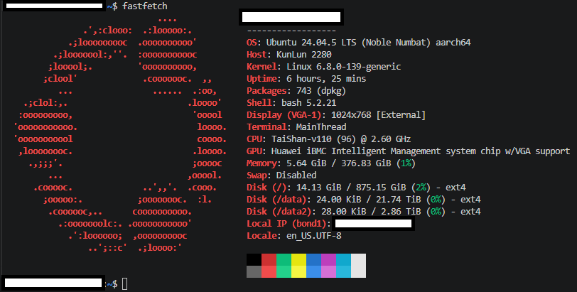
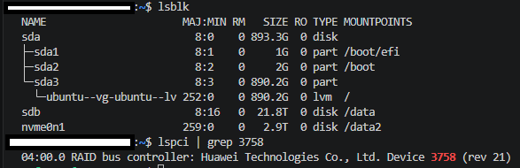

# DKMS wrapper and Prebuilt packages for Huawei SP686C RAID card #

## Installation (build from source) ##

- Perform [DKMS install](./source-olk66/readme.md#install-via-dkms) in page "mirror", in `tty2`.

## Installation guide (prebuilt package) ##

- Huawei SP686C install buide (installing OS): [ZH](https://support.huawei.com/enterprise/zh/doc/EDOC1100399960/eaf7ad55), [EN](https://support.huawei.com/enterprise/en/doc/EDOC1100527476/32dec9ca/installing-ubuntu)
  - tldr: `insmod` the [kernel module](./prebuilt-ko/), and `dpkg -i` for the [prebuilt package](./prebuilt-deb/).
  - *You probably need to build from source when there is no kernel module matching Linux kernel version (down to patch number).*
  - If success, make sure the post install scripts has been executed. Check out general *post install procedure for out-of-tree kernel module*. [Ref.](https://unix.stackexchange.com/questions/424599/is-update-initramfs-u-needed-after-adding-or-removing-a-module-with-modprobe)

- Huawei SP686C install buide (in OS): [CN](https://support.huawei.com/enterprise/zh/doc/EDOC1100408971/d57de8e6)
  - Notice that it has mentioned "build from source", with keywords like **"hisi_raid" and "OLK-6.6"**.

## Obtaining official prebuilt packags ##

- Using Ubuntu 24.04.5 for exmaple.

- Usually it is included as a part of "iDriver".
  - *Mostly locked in Huawei websites.*
  
- However, you may access them via [KunLun](https://support.kunlunit.com/support/#/zh/product?anchor=idriver&submodel=software). *Invisible in SEO, and ZH language only.*
  - iDriver (bottom) > Newest version > Ubuntu 24.04 (filter) > "1.0.7" (only 1 result)
  - Eventually you should find [KunLunServer iDriver-Ubuntu24.04-Driver-ARM_1.0.7.zip](https://support.kunlunit.com/support/#/zh/software-basics/3da0db7f-15af-4e8b-be0e-091d9d7ed09c)

- Extract the ISO and obtain the [kernel module](./prebuilt-ko/) and [prebuilt package](./prebuilt-deb/).

## Hardware info of SP686C ##

- Device ID: [PCI\VEN_19E5&DEV_3758](https://devicehunt.com/view/type/pci/vendor/19E5/device/3758)

- Product page: [CN](https://e.huawei.com/cn/products/computing/kunpeng/components/raid)

- User guide: [EN](https://support.huawei.com/enterprise/en/doc/EDOC1100540654/426cffd9/about-this-document)

## Gallary ##

## Extra: Installing Ubuntu 24.04 on the kunpeng920 server ##

- A lot easier than the desktop version. Based from [my experience](https://github.com/6DammK9/nai-anime-pure-negative-prompt/blob/main/ch04/itai.md), for desktop version, you may need a working 20.04 first, then upgrade major version one by one.
  - So far the server BIOS has the microcode fixed, which don't need the microcode level workaround.

- KunLun 2280 shares with TaiShan 2280: [CN](https://support.huawei.com/enterprise/zh/doc/EDOC1100464333/73cb4dc9)

- [The only Youtube Video shows working.](https://youtu.be/yYuSQDIqA2E?si=cPQ7x6PKXnbYlfA1)

- You need:
  - A recent BIOS or firmware: Probably 6.x or newer. The KunLun2280 above is 7.44 (U75).
  - iBMC chips: **Hi1711** or newer (Hi1710 cannot mount ISO properly).
  - Therefore, the server minor version: KunLun 2280(VD).
  - **Disable "Support SPCR"** in BIOS Menu (Advanced > MISC Config).
  - **Install OS vis KVM / VMM (Virtual Media Manager).** Tested with physical method (USB / CD), hit `SQUASHFS error` even same media with 20.04 just works. For enterprise network: `KVM=22,VMM=80,WEB=443`, then use Firefox to allow port 22 in `about:config`.
